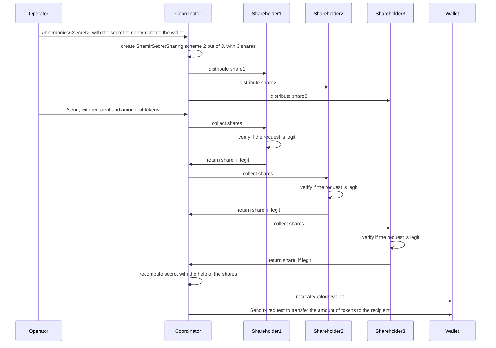

# shamir-coordinator-service
This service serves the purpose of creating and distributing shamir secret shares to a set of distributed shareholder services, and collecting them again in order to sign a transaction.
The transaction will be issued on Liquid. The elemnts RPC can be configured with `app.toml` file.
To ensure secure communication it utilizes mutual TLS. It offers two routes:

- URL: /send

  Method: POST

  Header: Content-Type: application/json
  
  Body: { "recipient": "recipient address","amount": "amount" }

- /mnemonics/:secret

  Method: POST

  Header: Content-Type: application/json

## Prerequisits
The creation and the recovery of the shares is done with the help of `https://github.com/rddl-network/bc-slip39-go`.
Therefore, the C libraries of BlockchainCommons need to be built.
Please execute the following:
```bash
git submodule update --init --recursive
pushd bc-slip39-go
./deps.sh
popd
```

The service expects that the used wallet got already created. It will load the wallet if it hasn't been loaded before but not unload after usage.

## Mechanics



## Execution

This service relies on TLS certificates.
See [example](example/README.md) to easily generate certificates for development.

The service can be executed via the following go command without having it previously built:
```bash
go run cmd/shamir-coordinator/main.go
```

## Configuration
The service needs to be configured via the ```./app.toml``` file or environment variables. The defaults are
```
asset-id = 'asset-id'
certs-path = './certs/'
log-level = 'info'
rpc-enc-timeout = 20
rpc-host = 'localhost'
rpc-password = 'password'
rpc-port = 18884
rpc-scheme = 'http'
rpc-user = 'user'
rpc-wallet-name = 'wallet'
service-bind = 'localhost'
service-port = 8080
shamir-shares = 3
shamir-threshold = 2
share-holder-list = 'https://localhost:8081,https://localhost:8082,https://localhost:8083'
test-mode = false
```
